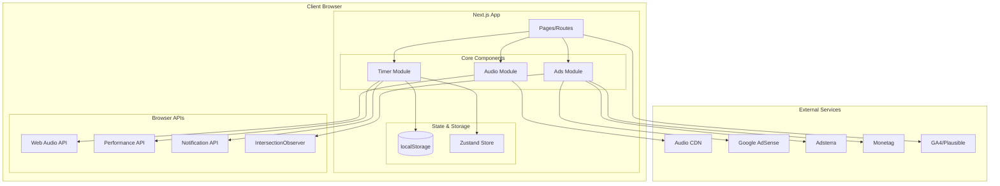
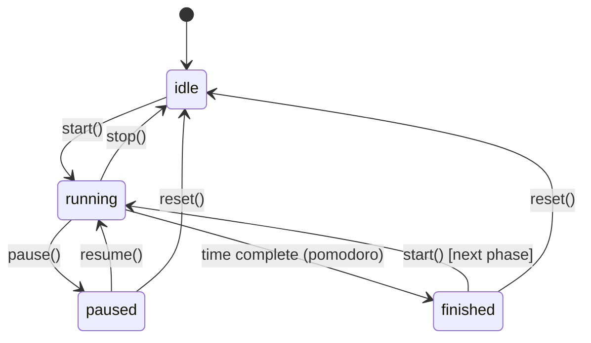
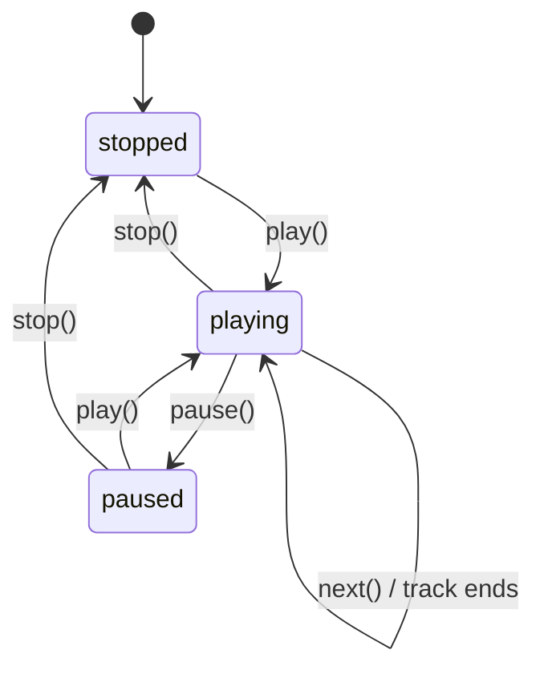
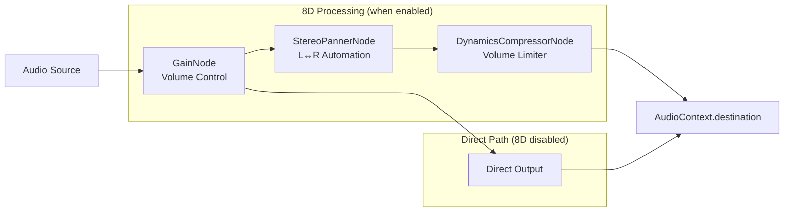
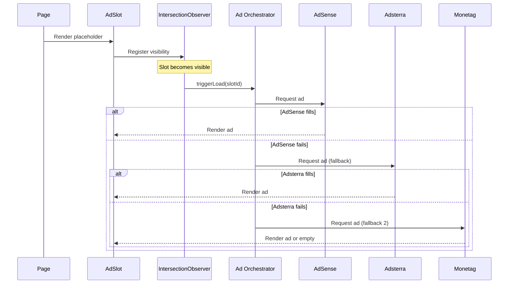

# Design Document: Haisa Web

## Overview

Haisa Web adalah aplikasi web fokus yang menggabungkan timer (stopwatch/pomodoro), music player dengan efek 8D, dan sistem monetisasi iklan multi-provider. Aplikasi dibangun menggunakan Next.js 14 (App Router) dengan TypeScript, Tailwind CSS, dan shadcn/ui untuk UI components.

Arsitektur mengutamakan:
- **Performance First**: Timer dan audio UI render duluan, ads load lazy
- **Offline Resilience**: State persistence via localStorage
- **Accurate Timing**: Timestamp-based calculation, bukan setInterval murni
- **Non-intrusive Ads**: Waterfall system dengan placement yang tidak mengganggu UX

## Architecture



## Components and Interfaces

### Timer Module

```typescript
// Timer State Machine
type TimerState = 'idle' | 'running' | 'paused' | 'finished';
type TimerMode = 'stopwatch' | 'pomodoro';
type PomodoroPhase = 'work' | 'break';

interface TimerConfig {
  mode: TimerMode;
  pomodoroWorkMinutes: number;  // default: 25
  pomodoroBreakMinutes: number; // default: 5
}

interface TimerSnapshot {
  state: TimerState;
  mode: TimerMode;
  startTimestamp: number | null;      // performance.now() saat start
  pausedElapsed: number;              // accumulated time saat pause
  pomodoroPhase: PomodoroPhase;
  pomodoroRemainingMs: number;
}

interface TimerHooks {
  onStart: () => void;
  onPause: () => void;
  onResume: () => void;
  onStop: (session: SessionData) => void;
  onFinish: (session: SessionData) => void;  // pomodoro phase complete
}

// useTimer Hook Interface
interface UseTimerReturn {
  // State
  state: TimerState;
  mode: TimerMode;
  elapsedMs: number;           // untuk stopwatch
  remainingMs: number;         // untuk pomodoro
  pomodoroPhase: PomodoroPhase;
  
  // Actions
  start: () => void;
  pause: () => void;
  resume: () => void;
  stop: () => void;
  reset: () => void;
  setMode: (mode: TimerMode) => void;
}
```

### Audio Module

```typescript
interface Track {
  id: string;
  title: string;
  artist: string;
  src: string;        // URL ke audio file
  duration: number;   // dalam detik
}

type Mood = 'happy' | 'neutral' | 'sad';

interface Playlist {
  mood: Mood;
  tracks: Track[];
}

interface AudioEngineConfig {
  enable8D: boolean;
  panCycleSeconds: number;  // 6-12 detik per cycle
  volumeLimit: number;      // 0-1, default 0.8
}

// Audio Engine Interface (Web Audio API wrapper)
interface AudioEngine {
  // Playback
  play: () => Promise<void>;
  pause: () => void;
  stop: () => void;
  next: () => void;
  previous: () => void;
  
  // Settings
  setVolume: (level: number) => void;  // 0-100
  set8DEnabled: (enabled: boolean) => void;
  setMood: (mood: Mood) => void;
  
  // State
  isPlaying: boolean;
  currentTrack: Track | null;
  currentMood: Mood;
  is8DEnabled: boolean;
  volume: number;
  progress: number;  // 0-100
}

// useAudioPlayer Hook Interface
interface UseAudioPlayerReturn extends AudioEngine {
  playlist: Track[];
  trackIndex: number;
}
```

### Ads Module

```typescript
type AdProvider = 'adsense' | 'adsterra' | 'monetag';
type AdSlotId = 
  | 'AD_TOP_LEADERBOARD'
  | 'AD_SIDE_RAIL_1'
  | 'AD_SIDE_RAIL_2'
  | 'AD_INCONTENT_1'
  | 'AD_BOTTOM';

interface AdSlotConfig {
  id: AdSlotId;
  sizes: {
    desktop: [number, number][];  // e.g., [[728, 90], [970, 90]]
    mobile: [number, number][];   // e.g., [[320, 100], [320, 50]]
  };
  providers: AdProvider[];        // waterfall order
  enabledDevices: ('desktop' | 'mobile')[];
  enabledPages: ('app' | 'blog' | 'landing')[];
  lazy: boolean;
  sticky: boolean;
}

interface AdConfig {
  enabled: boolean;
  slots: AdSlotConfig[];
  providers: {
    adsense: { clientId: string; enabled: boolean };
    adsterra: { key: string; enabled: boolean };
    monetag: { zoneId: string; enabled: boolean };
  };
}

// AdSlot Component Props
interface AdSlotProps {
  slotId: AdSlotId;
  className?: string;
}
```

### Storage Module

```typescript
interface SessionData {
  id: string;
  startTime: number;      // Unix timestamp
  endTime: number;
  duration: number;       // dalam ms
  mode: TimerMode;
  completed: boolean;     // true jika tidak di-stop manual
}

interface DailyStats {
  date: string;           // YYYY-MM-DD
  totalFocusMs: number;
  sessionCount: number;
  sessions: SessionData[];
}

interface StorageSchema {
  // Timer persistence
  timerSnapshot: TimerSnapshot | null;
  
  // Statistics
  dailyStats: Record<string, DailyStats>;  // key: YYYY-MM-DD
  lastSession: SessionData | null;
  
  // Preferences
  preferences: {
    timerMode: TimerMode;
    selectedMood: Mood;
    volume: number;
    is8DEnabled: boolean;
  };
}

// Storage Interface
interface StorageService {
  // Timer
  saveTimerSnapshot: (snapshot: TimerSnapshot) => void;
  getTimerSnapshot: () => TimerSnapshot | null;
  clearTimerSnapshot: () => void;
  
  // Stats
  saveSession: (session: SessionData) => void;
  getTodayStats: () => DailyStats;
  getLastSession: () => SessionData | null;
  
  // Preferences
  savePreferences: (prefs: Partial<StorageSchema['preferences']>) => void;
  getPreferences: () => StorageSchema['preferences'];
}
```

## Data Models

### Timer State Diagram



### Audio Player State Diagram



### 8D Audio Signal Flow



### Ad Waterfall Flow




## Correctness Properties

*A property is a characteristic or behavior that should hold true across all valid executions of a system-essentially, a formal statement about what the system should do. Properties serve as the bridge between human-readable specifications and machine-verifiable correctness guarantees.*

### Timer Properties

**Property 1: Timer state persistence round-trip**
*For any* timer snapshot (state, mode, startTimestamp, pausedElapsed), serializing to localStorage and deserializing should produce an equivalent timer snapshot.
**Validates: Requirements 1.6, 10.1**

**Property 2: Timestamp-based elapsed time accuracy**
*For any* running timer with a start timestamp, the calculated elapsed time should equal the difference between current time and start timestamp plus any previously accumulated paused time, regardless of when the calculation occurs.
**Validates: Requirements 1.5, 10.2**

**Property 3: Timer pause preserves elapsed time**
*For any* running timer with elapsed time E, pausing and then resuming should result in the timer continuing from elapsed time E (within 100ms tolerance for timing).
**Validates: Requirements 1.2, 1.3**

**Property 4: Timer reset returns to zero**
*For any* timer in any state (running, paused, finished), calling reset should result in state='idle' and elapsedMs=0.
**Validates: Requirements 1.4**

**Property 5: Session completion updates daily total correctly**
*For any* completed session with duration D, the daily total focus time should increase by exactly D milliseconds.
**Validates: Requirements 1.7, 3.2**

**Property 6: Session storage round-trip**
*For any* session data (id, startTime, endTime, duration, mode, completed), storing and retrieving should produce an equivalent session object.
**Validates: Requirements 3.1, 3.3**

**Property 7: Daily stats date partitioning**
*For any* two sessions with different dates (YYYY-MM-DD), they should be stored in separate daily stats entries and not affect each other's totals.
**Validates: Requirements 3.4**

### Pomodoro Properties

**Property 8: Pomodoro phase transitions**
*For any* pomodoro timer, when work phase (25 min) completes, the next phase should be break (5 min), and when break completes, the next phase should be work.
**Validates: Requirements 2.2, 2.3**

**Property 9: Pomodoro pause preserves phase and remaining time**
*For any* pomodoro timer in any phase with remaining time R, pausing should preserve both the current phase and remaining time R (within 100ms tolerance).
**Validates: Requirements 2.4**

### Audio Player Properties

**Property 10: Playlist navigation with looping**
*For any* playlist of length N, calling next() when at track index N-1 should result in track index 0, and calling next() at any index i < N-1 should result in index i+1.
**Validates: Requirements 4.3, 4.5, 4.6**

**Property 11: Volume clamping**
*For any* volume input value V, the resulting volume should be clamped to the range [0, 100].
**Validates: Requirements 4.4**

**Property 12: Mood playlist minimum tracks**
*For any* mood (happy, neutral, sad), the corresponding playlist should contain at least 3 tracks.
**Validates: Requirements 5.2**

**Property 13: Mood change resets to first track**
*For any* mood change from mood A to mood B while playing, the track index should reset to 0 and the current track should be from mood B's playlist.
**Validates: Requirements 5.3**

### 8D Audio Properties

**Property 14: 8D toggle audio routing**
*For any* audio engine state, enabling 8D should route audio through StereoPannerNode, and disabling 8D should bypass the panner node.
**Validates: Requirements 6.1, 6.2**

**Property 15: 8D volume limiting**
*For any* audio output when 8D mode is active, the peak amplitude should not exceed the configured volume limit threshold (default 0.8).
**Validates: Requirements 6.4**

### Ad System Properties

**Property 16: Ad waterfall fallback sequence**
*For any* ad slot with providers [P1, P2, P3] where P1 fails to fill, the system should attempt P2, and if P2 fails, attempt P3.
**Validates: Requirements 7.3**

**Property 17: Ad slot visibility-triggered loading**
*For any* ad slot configured with lazy loading, the ad script should only be loaded after the slot becomes visible via IntersectionObserver.
**Validates: Requirements 7.2**

**Property 18: Mobile ad slot limiting**
*For any* mobile viewport, the number of active ad slots should be less than or equal to the configured mobile slot limit.
**Validates: Requirements 7.5**

**Property 19: AdSense policy compliance**
*For any* page where AdSense is active, popunder and onClick ad formats should be disabled for all other providers.
**Validates: Requirements 7.6**

### State Recovery Properties

**Property 20: Corrupted state recovery**
*For any* invalid or corrupted timer snapshot in localStorage, restoring should result in a safe default state (idle, elapsedMs=0) rather than throwing an error.
**Validates: Requirements 10.4**

**Property 21: State change triggers persistence**
*For any* timer state transition (start, pause, resume, stop, reset), the new state should be persisted to localStorage immediately after the transition.
**Validates: Requirements 10.3**

## Error Handling

### Timer Errors

| Error Scenario | Handling Strategy |
|----------------|-------------------|
| localStorage unavailable | Fall back to in-memory state, warn user that progress won't persist |
| Corrupted timer snapshot | Reset to idle state, log error, clear corrupted data |
| Invalid timestamp (future date) | Recalculate from current time, log warning |
| Browser tab crash during session | On next load, detect incomplete session and offer to restore or discard |

### Audio Errors

| Error Scenario | Handling Strategy |
|----------------|-------------------|
| Audio file 404 | Skip to next track, show toast notification |
| AudioContext creation fails | Fall back to HTMLAudioElement without 8D |
| Autoplay blocked | Show play button prominently, require user click |
| All tracks in mood fail to load | Show error message, suggest trying different mood |
| Web Audio API unsupported | Disable 8D toggle, use standard audio playback |

### Ad Errors

| Error Scenario | Handling Strategy |
|----------------|-------------------|
| All providers fail to fill | Show empty slot or house ad |
| Ad script timeout (>5s) | Cancel load, try next provider |
| Ad causes layout shift | Reserve fixed dimensions, use skeleton placeholder |
| Provider SDK error | Log error, disable provider for session, try fallback |

## Testing Strategy

### Property-Based Testing Library

**Library**: [fast-check](https://github.com/dubzzz/fast-check) for TypeScript/JavaScript

fast-check is chosen because:
- Native TypeScript support
- Excellent shrinking for minimal failing examples
- Built-in arbitraries for common types
- Easy integration with Jest/Vitest

### Configuration

```typescript
// fast-check configuration
fc.configureGlobal({
  numRuns: 100,           // minimum 100 iterations per property
  verbose: true,          // show all generated values on failure
  seed: Date.now(),       // reproducible with logged seed
});
```

### Unit Tests

Unit tests will cover:
- Timer state machine transitions (specific examples)
- Audio player edge cases (empty playlist, single track)
- Ad slot configuration validation
- localStorage serialization edge cases
- Date boundary handling for daily stats

### Property-Based Tests

Each correctness property will have a corresponding property-based test:

```typescript
// Example: Property 4 - Timer reset returns to zero
// **Feature: haisa-web, Property 4: Timer reset returns to zero**
test('reset always returns timer to idle with zero elapsed', () => {
  fc.assert(
    fc.property(
      fc.record({
        state: fc.constantFrom('running', 'paused', 'finished'),
        elapsedMs: fc.integer({ min: 0, max: 3600000 }),
        mode: fc.constantFrom('stopwatch', 'pomodoro'),
      }),
      (timerState) => {
        const timer = createTimer(timerState);
        timer.reset();
        expect(timer.state).toBe('idle');
        expect(timer.elapsedMs).toBe(0);
      }
    )
  );
});
```

### Test Organization

```
src/
  components/
    timer/
      useTimer.ts
      useTimer.test.ts          # Unit tests
      useTimer.property.test.ts # Property-based tests
    audio/
      useAudioEngine.ts
      useAudioEngine.test.ts
      useAudioEngine.property.test.ts
    ads/
      AdOrchestrator.ts
      AdOrchestrator.test.ts
      AdOrchestrator.property.test.ts
  lib/
    storage.ts
    storage.test.ts
    storage.property.test.ts
```

### Test Coverage Goals

- Unit tests: Cover all public API methods and edge cases
- Property tests: Cover all 21 correctness properties
- Integration tests: Cover critical user flows (start timer → play music → complete session)
